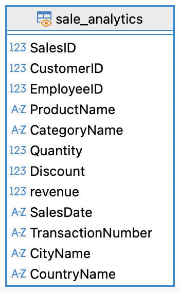

# Grocery Store Sales Analytics

## 📌 Project Overview

The project uses the Grocery Sales Database from [Kaggle](https://www.kaggle.com/datasets/andrexibiza/grocery-sales-dataset), a relational dataset containing sales transactions, customer and employee information, product details, and geographic data across cities and countries. The dataset is used to analyze sales performance and generate business insights through SQL and data visualization.

## 📂 Project Files
| Files | Description| Tools |
| ------| -----------| -----------------|
|`scripts/01_constrants.sql`| Define primary and foreign key relationships | PostgreSQL |
|`scripts/02_sale_analytics.sql`| Create sale analytics table | PostgreSQL |
|`scripts/03_business_queries.sql`| SQL queries for business analysis | PostgreSQL |
|`sale_analysis.md`| Summary of business analysis and findings | Git markdown |

## 🔗 Database

### Table Description
| Table        | Description                      |
| ------------ | -------------------------------- |
| `sales`      | Sales transactions               |
| `products`   | Product information              |
| `categories` | Product categories               |
| `customers`  | Customer information             |
| `employees`  | Employee/salesperson information |
| `cities`     | City and location information    |
| `countries`  | Country information              |

### Analytics View 
- File: `02_sale_analytics.sql` 
- To simplify the analysis, the analytics view was created by joining the relevant operational tables. The view combines sales transactions with product, category, customer, employee, city, and country information, providing a single dataset for answering business questions with SQL.
- Analytics view:

## 🛠️ Tools and skills

- SQL (DDL, DML, JOINs, Views, Aggregations)
- Relational Database Design (Primary & Foreign Keys)
- Business Intelligence & KPI Reporting