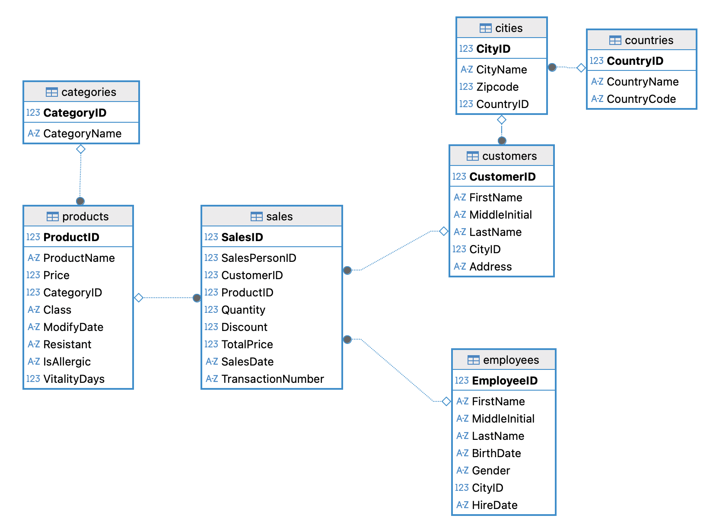

# Grocery Store Sales Analytics

## 📌 Project Overview

The project uses the Grocery Sales Database from [Kaggle](https://www.kaggle.com/datasets/andrexibiza/grocery-sales-dataset), a relational dataset containing sales transactions, customer and employee information, product details, and geographic data across cities and countries. The dataset is used to analyze sales performance and generate business insights through SQL and data visualization.

## 🔗 Database

### Table Description
| Table        | Description                      |
| ------------ | -------------------------------- |
| `sales`      | Sales transactions               |
| `products`   | Product information              |
| `categories` | Product categories               |
| `customers`  | Customer information             |
| `employees`  | Employee/salesperson information |
| `cities`     | City and location information    |
| `countries`  | Country information              |

## 📂 Project Files
| Files | Description| Tools |
| ------| -----------| -----------------|
|`scripts/01_constrants.sql`| Define primary and foreign key relationships | PostgreSQL |
|`scripts/02_sale_analytics.sql`| Create sale analytics table | PostgreSQL |
|`scripts/03_business_queries.sql`| SQL queries for business analysis | PostgreSQL |
|`sale_analysis.md`| Summary of business analysis and findings | Git markdown |
| `dashboard` | Data visualization of business analysis (... in progress) | Tableau |

## 🛠️ Tools and skills

- SQL (DDL, DML, JOINs, Views, Aggregations)
- Relational Database Design (Primary & Foreign Keys)
- Data Visualization (... in progress)
- Business Intelligence & KPI Reporting